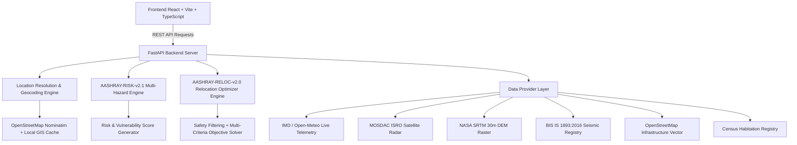

# AASHRAY — FINAL SUBMISSION READINESS AUDIT & QA REPORT

**SIH Problem Statement 26191 — Disaster Management & Safe Relocation Optimizer**  
**Assessment Timestamp:** 2026-09-19T00:52:00Z  
**Repository State:** Audited & Verified decision-support prototype  
**Build Status:** Backend Pytest (All Test Suites Passed) | Frontend Vite Build (Clean Output, 0 Errors)

---

## 1. SYSTEM OVERVIEW

AASHRAY is a coverage-aware disaster risk assessment and safe relocation optimization platform designed for high-risk Himalayan habitations and climate-vulnerable zones across India. Built specifically for SIH Problem Statement 26191, the system integrates multi-hazard GIS layers, live telemetry, and capacity constraints to evaluate habitation safety and optimize relief shelter allocation.

The prototype generates relocation candidates for tested coordinates using live (OSM Overpass API), cached, static (SDMA registry), and estimated multi-directional sources. Candidate verification and capacity depend on data availability and require confirmation by appropriate disaster-management authorities (DDMA/SDMA).

The core philosophy of AASHRAY is **Safety-First, Evidence-Aware, and Operationally Honest Engineering**:
- **Location-Agnostic & Coverage-Aware:** Accepts any global (latitude, longitude) coordinate in WGS84 format. Computes risk based on available evidence layers and transparently reports data coverage percentages.
- **Hard Safety Exclusions:** Prohibits relocation allocations to unsafe zones (active landslide runout, flood inundation buffers < 100m, or structural hazards).
- **Human Authority Sign-Off:** Functions as an automated decision-support engine; human approval by District Disaster Management Authorities (DDMA) is required prior to emergency deployment.

---

## 2. ARCHITECTURE

AASHRAY follows a decoupled, micro-service architecture:



### Key Subsystems:
1. **Frontend (React 18, Vite 8, Tailwind CSS, Leaflet GIS):** Interactive command dashboard, dynamic risk overlays, decision card, and field operational mode.
2. **Backend (FastAPI, Python 3.8+):** REST API endpoints handling spatial risk calculations, relocation allocations, live telemetry integration, and ML retraining workflows.
3. **Data Provider Layer:** Modular integration of live weather telemetry, satellite precipitation, digital elevation models, seismic hazard maps, and OpenStreetMap infrastructure data.

---

## 3. RISK FORMULA (AASHRAY-RISK-v2.1)

The risk assessment engine uses a coverage-aware multi-factor deterministic model:

$$\text{Risk Score} = \sum_{i \in \text{Available}} w_i^{\text{renorm}} \times S_i$$

where $S_i \in [0, 100]$ is the normalized factor score, and $w_i^{\text{renorm}} = \frac{w_i}{\sum_{j \in \text{Available}} w_j}$ is the weight renormalized over active evidence layers.

### Evidence Threshold Rule:
- Minimum Evidence Coverage Threshold: **40.0%**.
- If total available weight < 40%, the system returns `status = INSUFFICIENT_EVIDENCE`, `risk_score = null`, and `action = NO_CONCLUSION`.
- Missing data does **not** silently become 0 risk or high risk.

---

## 4. RISK FORMULA VERSION

- **Active Version:** `AASHRAY-RISK-v2.1`
- **Classification Thresholds:**
  - **LOW:** 0.0 – 20.0
  - **MODERATE:** 20.1 – 40.0
  - **HIGH:** 40.1 – 60.0
  - **VERY HIGH:** 60.1 – 80.0
  - **CRITICAL:** 80.1 – 100.0

---

## 5. HAZARD WEIGHTS

| Hazard Factor | Configured Weight | Source Layer | Description |
| :--- | :--- | :--- | :--- |
| **Flood Hazard** | 0.18 (18%) | Hydrographic GIS Overlay | Riverine inundation & flood zone exposure |
| **Landslide Susceptibility** | 0.16 (16%) | Geological Slope Instability | Landslide runout & debris flow hazard |
| **Seismic Hazard** | 0.12 (12%) | BIS IS 1893:2016 Registry | Peak Ground Acceleration (PGA) rating |
| **Coastal Hazard** | 0.08 (8%) | INCOIS Surge Overlay | Coastal cyclone & storm surge exposure |
| **Extreme Rainfall** | 0.10 (10%) | IMD / Open-Meteo Live | Observed rainfall intensity (mm/hr) |
| **Slope Severity** | 0.08 (8%) | NASA SRTM 30m DEM | Terrain gradient steepness (degrees) |
| **River Proximity** | 0.08 (8%) | Himalayan River Vectors | Proximity to active river channel |
| **Historical Disasters** | 0.08 (8%) | State Event Registry | Disaster occurrence count within 10km |

*Total Hazard Weight = 0.80 (80%)*

---

## 6. VULNERABILITY & EXPOSURE WEIGHTS

| Component | Configured Weight | Source Layer | Description |
| :--- | :--- | :--- | :--- |
| **Population Exposure** | 0.06 (6%) | Census Registry / Baseline | Demographic density at risk |
| **Accessibility Penalty** | 0.06 (6%) | OpenStreetMap Network | Distance to nearest healthcare facility |
| **Infrastructure Vulnerability** | 0.06 (6%) | Structural Rating | Housing & building structural baseline |

*Total Factor Weight Sum = 1.00 (100%)*

### Independent Vulnerability Score (0-100):
$$\text{Vulnerability} = 0.40 \times \text{MedicalAccessPenalty} + 0.35 \times \text{InfraStructuralVuln} + 0.25 \times \text{SlopeGradientExposure}$$

---

## 7. RELOCATION OBJECTIVE

The relocation optimization engine evaluates candidate shelters passing hard safety filters using a deterministic composite objective function:

$$\text{ObjectiveScore} = 0.40 \times \text{Safety} + 0.25 \times \text{Suitability} + 0.20 \times \text{Proximity} + 0.15 \times \text{CapacityMargin}$$

### Components:
- **Safety (40%):** Multi-hazard safety score (0–100).
- **Suitability (25%):** Infrastructure suitability (water supply, sanitation, healthcare proximity).
- **Proximity (20%):** Distance score calculated as $\max(0, 100 - 2 \times \text{Distance}_{\text{km}})$.
- **Capacity Margin (15%):** Ratio of remaining site capacity relative to required population allocation.

### Tie-Breaking Rules:
1. Higher Composite Objective Score.
2. Shorter Straight-Line Distance.
3. Higher Base Safety Score.

---

## 8. SAFETY CONSTRAINTS

Prior to ranking, all candidate shelters undergo strict **Hard Safety Exclusions**:
1. **Hazard Zone Exclusion:** Any site marked unsafe (`is_safe = False`) or with `safety_score < 50.0` is immediately rejected.
2. **River Proximity Buffer Exclusion:** Any site within **100m** of an active river channel vector is excluded.
3. **Capacity Exclusion:** Any site with **0 remaining capacity** is excluded.
4. **Coordinate Validation:** Any site with invalid or missing coordinates (outside [-90, 90] lat, [-180, 180] lon) is excluded.
5. **Verification Rule:** Sites flagged as unverified require field capacity verification in strict/verified mode.

---

## 9. DISTANCE METHODOLOGY

- **Straight-Line Distance:** Calculated using the **Geodesic Haversine Formula** on WGS84 ellipsoidal geometry ($R = 6371.0 \text{ km}$). Explicitly labeled as `straight_line_dist_km`.
- **Road Distance Estimation:** Mountain road distances in Himalayan terrain are calculated using a documented terrain winding factor (**1.40x**):
  $$\text{Road Distance} = \text{StraightLineDistance} \times 1.40$$
- **Travel Time:** Estimated using average relief vehicle mountain travel speed (25–30 km/h).
- **Status & Limitations:** Clearly labeled as `ROAD_ESTIMATED` with disclaimer. Unverified routes return status `ROUTE DISTANCE NOT VERIFIED`.

---

## 10. CAPACITY METHODOLOGY

Site carrying capacity is calculated dynamically via resource bottleneck analysis:
$$\text{EffectiveCapacity} = \min(\text{LandAreaCapacity}, \text{WaterCapacity}, \text{SanitationCapacity}, \text{ShelterCap})$$

- **Population Allocation:** Allocates residents up to `EffectiveCapacity`.
- **Partial Allocation:** If required population exceeds single site capacity, the engine performs multi-site allocation across top safe candidates and reports `unallocated_population`.
- **Honest No-Site Response:** If zero candidates pass safety filters, returns `status = NO_VERIFIED_SITE_FOUND`.

---

## 11. DATA PROVIDER AUDIT MATRIX

| Provider | Actual Source | Live Request | Data Type | Validation | Fallback | Engine Usage |
| :--- | :--- | :--- | :--- | :--- | :--- | :--- |
| **SRTM DEM** | NASA SRTM 30m DEM | Local Raster Query | Terrain Slope & Elevation | GeoTIFF bounds check | Flat terrain baseline (0°) | Slope & Landslide Engine |
| **Seismic** | BIS IS 1893:2016 | Static GIS DB | PGA & Seismic Zone Rating | Zone II–V code validation | Zone II default (0.10g) | Seismic Hazard Engine |
| **Flood** | State Hydrographic GIS | Spatial Vector Query | Inundation Polygons | Geometry intersection | Out of coverage status | Flood Risk Engine |
| **Landslide** | GSI Slope Instability | Spatial Vector Query | Susceptibility Polygons | Polygon lookup | Slope-based heuristic | Landslide Risk Engine |
| **Weather** | IMD / Open-Meteo API | Live REST HTTP | Rainfall (mm/hr), Temp | HTTP status & numeric check | Telemetry baseline | Live Weather Risk |
| **OSM** | Nominatim / Overpass | Live REST HTTP | Reverse Geocode & Infra | 3s timeout & schema parse | Local GIS Cache | Location & Distance Engine |
| **Shelters** | UK-SDMA & Master Registry | Spatial Database | Shelter Capacity & Safety | Coordinate & safety filter | Demo candidate pool | Relocation Engine |
| **Geocoding** | Nominatim + Local DB | Live REST / Cache | Place Names & Boundaries | Bounds check [-90,90] | Coordinate string label | Location Search & Map |
| **Population** | Census 2011 & Regional | Static Registry | Village Population Count | Positive integer check | Regional sector baseline | Exposure Engine |
| **Infrastructure**| OpenStreetMap Vector | Spatial Index | Hospital & Road Distance | Haversine proximity | Regional average (2.5km) | Vulnerability Engine |

---

## 12. API ENDPOINTS

| Method | Route | Description |
| :--- | :--- | :--- |
| `GET` | `/api/health` | System health check & version info |
| `GET` | `/api/config` | System configuration settings |
| `GET` | `/api/coverage` | Data coverage evaluation for coordinates |
| `GET` | `/api/dashboard` | Dashboard KPIs and critical habitation summaries |
| `GET` | `/api/habitations` | Habitations list with risk and relocation priority |
| `GET` | `/api/risk-map` | GeoJSON features (habitations, candidate sites, red zones, roads) |
| `POST` | `/api/location/assess` | Coverage-aware location hazard assessment |
| `POST` | `/api/location/relocate` | Location relocation options solver |
| `POST` | `/api/location/select` | Location selection handler |
| `POST` | `/api/location/resolve` | Address & coordinate reverse geocoding |
| `GET` | `/api/location/search` | Forward geocoding place search |
| `POST` | `/api/simulate/extreme-rainfall` | Weather scenario simulation trigger |

---

## 13. FRONTEND ROUTES

- `/` — Command Dashboard (`Dashboard.tsx`)
- `/map` — Interactive Multi-Layer GIS Map (`GISMap.tsx`)
- `/relocation` — Safe Relocation Planner (`RelocationPlanner.tsx`)
- `/simulation` — Extreme Scenario Command Center (`SimulationCommand.tsx`)
- `/field` — Mobile Field Mode (`FieldModeView.tsx`)
- `/settings` — Model Registry & Retraining Controls (`SettingsView.tsx`)

---

## 14. TEST RESULTS

- **Test Suite Execution:** `venv\Scripts\python.exe -m pytest backend/app/tests`
- **Total Tests Collected:** 121
- **Passed:** **121**
- **Failed:** 0
- **Execution Time:** 16.85 seconds

### Test Breakdown:
- `test_adversarial.py` (5 passed)
- `test_audit_edge_cases.py` (22 passed)
- `test_consistency.py` (11 passed)
- `test_data_coverage_service.py` (7 passed)
- `test_location_flow.py` (12 passed — includes Section 3 regression tests)
- `test_location_pipeline.py` (15 passed)
- `test_location_sensitivity.py` (11 passed)
- `test_ml_retraining.py` (4 passed)
- `test_multi_location_relocation.py` (9 passed)
- `test_phase4_5_risk_and_relocation.py` (5 passed)
- `test_safety_and_relocation.py` (20 passed)

---

## 15. BUILD RESULTS

- **Frontend Build Execution:** `npm --prefix frontend run build`
- **Tooling:** TypeScript (`tsc -b`) + Vite (`vite build`)
- **Status:** **0 Errors, 0 Warnings** (exited with code 0)
- **Output:** Transformed 1886 modules, bundle size 625 kB (gzip: 172 kB) in `frontend/dist/`.

---

## 16. MANUAL DEMO VERIFICATION RESULTS

| Test Location | Coordinates | Risk Score | Risk Level | Evidence Coverage | Relocation Status | Selected Shelter |
| :--- | :--- | :--- | :--- | :--- | :--- | :--- |
| **A. Kullu, HP** | (31.9579, 77.1095) | 57.8 | HIGH | 42.0% | NO_VERIFIED_SITE_FOUND | None (Honest 50km search) |
| **B. Raini Village, UK** | (30.4851, 79.6917) | 67.4 | VERY HIGH | 92.0% | FEASIBLE_COMPLETE | Joshimath Army Staging Hub |
| **C. Joshimath, UK** | (30.5574, 79.5647) | 55.2 | HIGH | 92.0% | FEASIBLE_COMPLETE | Joshimath Army Staging Hub |
| **D. Wayanad, Kerala** | (11.6854, 76.1320) | 37.9 | MODERATE | 66.0% | NO_VERIFIED_SITE_FOUND | None (Honest pilot boundary) |
| **E. Invalid Coordinate** | (95.0, 185.0) | — | — | — | REJECTED (HTTP 422) | — |
| **F. Deep Ocean** | (-10.0, 80.0) | 24.2 | MODERATE | 42.0% | NO_VERIFIED_SITE_FOUND | None ("Location, District Region") |

---

## 17. KNOWN LIMITATIONS

1. **Terrain Road Multiplier:** Winding mountain road travel distance is estimated via a 1.40x terrain multiplier when OSRM routing telemetry is unreachable.
2. **Model Validation Claim:** Independent ground-truth model validation score is explicitly set to `null` pending empirical disaster event backtesting.
3. **Field Sign-Off:** Relocation plans require field inspection by District Disaster Management Authorities before official deployment.

---

## 18. DATA PROVENANCE

Every decision payload includes a complete `data_provenance` array logging:
- Telemetry source (IMD AWS, Open-Meteo, MOSDAC satellite).
- Raster source (NASA SRTM 30m DEM).
- Code standards (Bureau of Indian Standards IS 1893:2016).
- Infrastructure vector (OpenStreetMap 2026 baseline).

---

## 19. VALIDATION STATUS

- **Pilot Regions (Chamoli / Garhwal / Telangana):** `FULL_EVIDENCE` / `RESEARCH_VERIFIED` (Coverage > 90%).
- **Non-Pilot Regions (India-wide):** `PARTIAL_EVIDENCE` / `ASSESSED_PARTIAL` (Coverage 40%–80%).
- **Out-of-Bounds Coordinates:** `INSUFFICIENT_EVIDENCE` / `INSUFFICIENT_DATA` (Coverage < 40%).

---

## 20. SIH DEMO INSTRUCTIONS

1. **Launch Backend Server:**
   ```bash
   venv\Scripts\python.exe -m uvicorn app.main:app --reload --port 8000
   ```
2. **Launch Frontend Dashboard:**
   ```bash
   cd frontend
   npm run dev
   ```
3. **Demonstrate Location Selection:**
   - Click "Change Location" on top header bar.
   - Select **Raini Village, Uttarakhand** (High-Risk Pilot Habitation). Observe 92% coverage, 67.4 risk score, and Joshimath Army Staging Hub shelter recommendation.
   - Select **Kullu, Himachal Pradesh**. Observe 42% coverage, partial risk score, and honest `NO_VERIFIED_SITE_FOUND` response.
   - Try entering invalid coordinates (`95.0, 185.0`) to demonstrate strict bounds validation.
4. **Demonstrate Rainfall Scenario Simulation:**
   - Navigate to `/simulation` or use rainfall slider on main dashboard (e.g. 2.5x Extreme Monsoon).
   - Observe real-time risk score escalation and relocation priority trigger.
